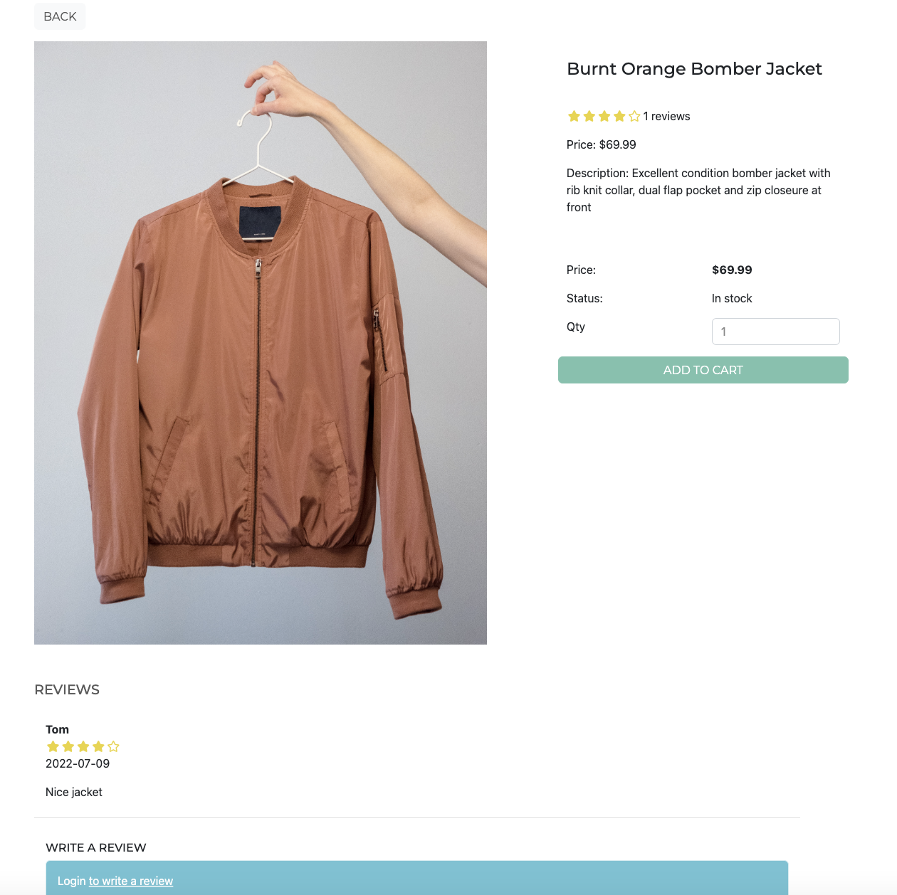
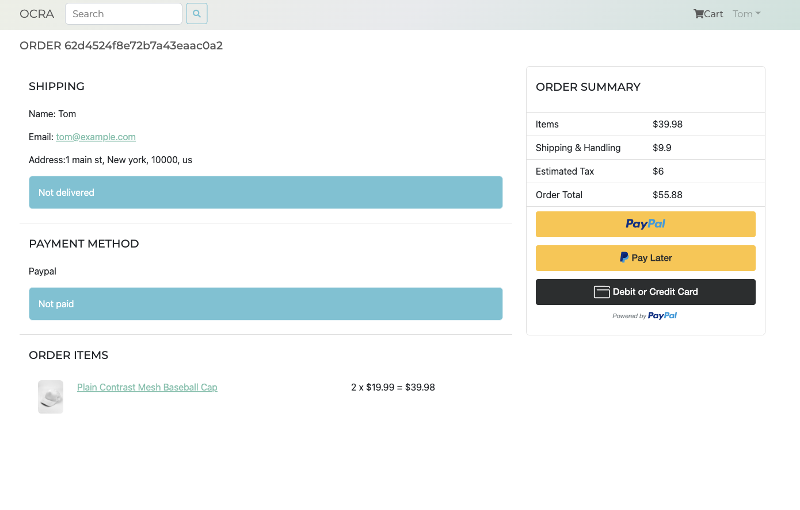
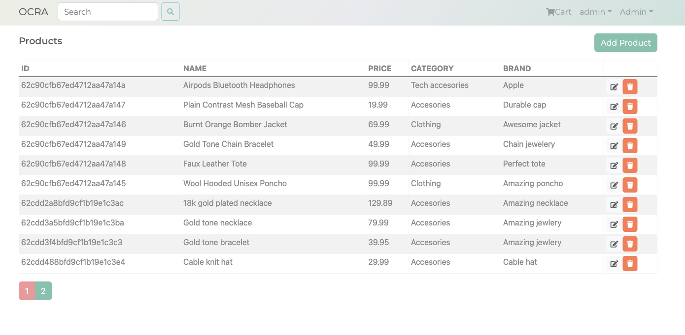

# Ocra

Ocra is an e-commerce web application features product search, product carousel, checkout with Paypal, and admin system.

# Set up

Create .env in the root folder. Below is an example of it.

```
NODE_ENV = development
PORT = 8000
MONGO_URI = Your MangoDB database url
JWT_SECRET = A string
PAYPAL_CLIENT_ID = Your Paypal client id
```

Install dependencies

```
# server side
npm install

# client side
cd app
npm install
```

# Run

Insert sample data to database

```
npm run data:insert
```

Remove all data from databse

```
npm run data:delete
```

Run

```
npm run dev
```

# Major screens

Home screen features top rated products carousel, products listing with pagination, products search, and direct to cart and login screens


Product detail screen features product information display, rating/review display, user comment



Checkout screent features checkout process, and Paypal payment



Admin system features products, users, and orders management


